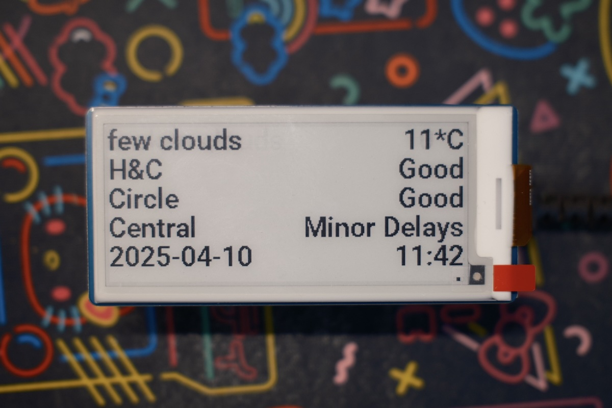

# London Underground Status – e-Paper Display (Raspberry Pi Pico W)

Display line status, weather, date and time on an e-Paper display

## Preparation

- Line status information needs [TFL Unified API](https://api-portal.tfl.gov.uk/)
- Weather information needs [OpenWeatherMap](https://openweathermap.org/appid)
- Raspberry Pi Pico W with micropython [firmware](https://micropython.org/download/RPI_PICO_W/)
    - I used a WaveShare 2.9-inch display [wiki](https://www.waveshare.com/wiki/Pico-ePaper-2.9), possible alternative see [Development](#development)
- (optional) Visual Studio Code with MicroPico extension: easy to edit and upload the project to the board
- (optional) more accurate geocoordinates using google maps via right-click on the point of interest

## Configure and Deploy

1. Clone the repo
    ```shell
    git clone https://github.com/HCui91/pico_tfl_epd.git
    ```
2. Create the config file from example and fill information
    ```shell
    cd pico_tfl_epd
    cp configs.py.example configs.py
    EDITOR configs.py
    ```
    - `TFL_APP_KEY`: [TFL Unified API](https://api-portal.tfl.gov.uk/) key from profile page
    - `WIFI_SSID` and `WIFI_PASSWORD`
    - `WEATHER_API_KEY`: API key from [OpenWeatherMap](https://openweathermap.org/appid)
    - `WEATHER_LAT` and `WEATHER_LON`: lattitude and longitude for the realtime weather
    - `NTP_SERVER`: URL or IP address of the NTP server, default is from [NTP pool project UK]("https://www.ntppool.org/zone/uk")
    - `TZ_OFFSET` and `BST`: time zone offset to GMT and option for automatic British Summer Time conversion
    - `LINE_IDS` and `LINE_TITLES`: ID from [API Line Search]("https://api-portal.tfl.gov.uk/api-details#api=Line&operation=Line_SearchByPathQueryQueryModesQueryServiceTypes") and titles to be shown on the display. If more than 3 lines (or other depends on the display size), first 3 is displayed.

3. Upload the configured project to Pico and run
    - In VSCode + MicroPico extension, click `All commands -> Upload project to Pico` 
    
## How It Works
- The display refreshes upon entering the main loop after initialisation (WiFi setup, time synchronisation, and testing TFL and weather APIs).
- A blinking dot at the bottom-right corner of the display indicates the main loop is running.
- Full display refreshes occur at a minimum interval of 3 minutes, while partial refreshes happen every minute to update the clock. Partial refreshes may cause ghosting, which clears during the next full refresh.
- TFL line status and weather information are updated every 90 seconds.
- Time synchronisation is performed every 24 hours.

## Development
- `robotosemibold24.py` uses Roboto Semibold font at 24 pt. Could use other font created by [font_to_py](https://github.com/peterhinch/micropython-font-to-py/blob/master/FONT_TO_PY.md)
- `Pico_ePaper_2in9.py` as the display driver. Alternative display driver with similar functions (check `writer.py`) should also work. 
- Run `logging.py` directly to print the log file `main.log` on console.

## Related projects
- Another implementation but on an OLED display with buttons [pico_tfl_departure_board](https://github.com/HCui91/pico_tfl_departure_board)
- [micropython-font-to-py's writer.py](https://github.com/peterhinch/micropython-font-to-py/blob/master/writer/writer.py)